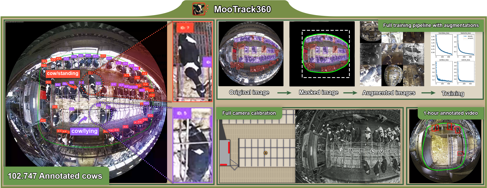
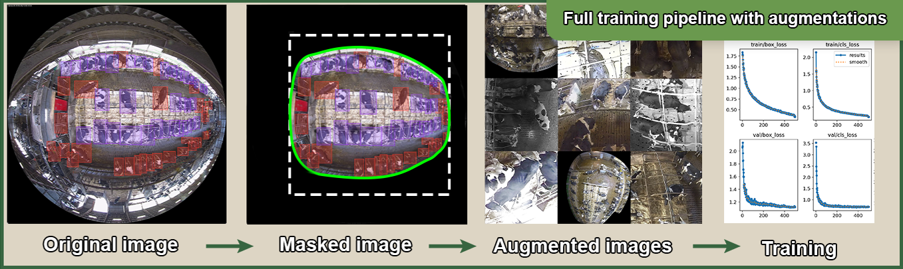
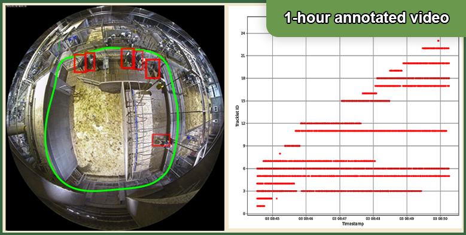

# 🐮 MooTrack360:  Novel Fisheye Camera Dataset for Robust Multi Dairy Cow Detection and Tracking


[](https://doi.org/10.1109/XXXX.2025.1234567)
[](LICENSE)
[](https://github.com/Gjerlund/MooTrack360/issues)
[](https://github.com/Gjerlund/MooTrack360/issues/issues?q=is%3Aissue+is%3Aclosed)

<p align="center">
A novel top-down fisheye dataset designed to facilitate around-the-clock livestock monitoring of Holstein dairy cows in large-scale stables. By providing 102.747 annotated cows through 1.500 images — each labelled as "<em>standing</em>" or "<em>lying</em>" — and an additional one-hour annotated video sequence for tracking evaluation, our dataset supports robust detection across variable lighting (from daylight to infrared) and enables direct welfare assessment. To correct fisheye distortion, we provide a detailed calibration pipeline based on the Double Sphere Camera model, ensuring precise localization and consistent annotations. Alongside the dataset, we release an end-to-end training framework that addresses common challenges such as illumination changes and occlusions. Benchmarks using state-of-the-art detection and tracking methods demonstrate the dataset’s capacity to drive advances in non-invasive, camera-based dairy farm monitoring.
</p>
<hr>
<h3 align="center">Content:</h3>

<p align="center">
  <a href="#sec-dataset">🐄 Dataset</a> ·
  <a href="#sec-getting-started">ℹ️ Getting Started</a> ·
  <a href="#sec-installing">🎛️ Installing</a> ·
  <a href="#sec-training">📈 Training</a> ·
  <a href="#sec-deployment">⏯️ Deployment</a> ·
  <a href="#sec-authors">🧑‍🏫 Authors</a> ·
  <a href="#sec-license">ℹ️ License</a> ·
  <a href="#sec-citing">📚 Citing</a> ·
  <a href="#sec-acknowledgments">👏 Acknowledgments</a>
</p>
<hr>

<a id="sec-dataset"></a>
## 🐄 The Dataset

The MOOTrack360 is stored on Zenodo and contains the following content:

 - 1.500 frames annotated -> used for training new detection models. 
 - 1-hour annotated video sequence -> used for evaluating tracker performance.
 - The custom trained detection models -> used in the paper. 
 - Several video sequences -> ideal for the development of new solutions.

<a id="sec-getting-started"></a>
## ℹ️ Getting Started 

All of the data can be downloaded directly from Zenodo at ??. Please keep in mind there is more that 150 GB of data currently in the MOOTrack360. The following section will introduce the whole procedure of setting up the dataset for training, exporting a new detection model, and running the detector-tracker in conjuction on the a video sequence as done in the paper. 

### 💻 System Requriements 

At minimum the used PC needs a GPU that is CUDA'enabled as parts of the source code is optimized for this. For the paper a PC with the following specification was used:
- _Intel Core i9-14900KF processor_
- _NVIDIA GeForce RTX 4090 GPU_
- _64 GB of RAM_
- _Python 3.10.11_

While any IDE can be used, we recommend using Visual Studio Code (VSCode), as it was used during development and the creation of the dataset.

<a id="sec-installing"></a>
## 🎛️ Installing

The easiet setup is to install MOOTrack360 in a virtual environment and install the needed packages from the requirements.txt.

clone the repository to a desired location
```python
    git clone https://github.com/SDU-Robotics/MooTrack360.git
```

Open the parent directory of the proejct in VSCode 
```python
    start visual studio code
    cd ../MOOTrack360
```

Intialize and activate/source the virtual environment
```python
    python3 -m venv venv
```
```python
    source venv/bin/activate       # Linux/Mac
    # or
    .\venv\Scripts\activate        # Windows
```

Install dependencies
```python
    pip install -r requirements.txt
```

<a id="sec-training"></a>   
## 📈 Training of new detection models



We provide scripts that you can use to train new detection models on the MOOTrack360. If you just want to use of the custom trained one that has been used in the paper, please skip this section.

## The process for training a new model is as follow: 
 - 1️⃣ Download the 1.500 annotated frames to the folder, "raw_images". These images can be directly downloaded from Zenodo or by running _dataset_download.py_.
 - 2️⃣ Run the _create_yolo_coco_dataset.py_ to generate a yolo- and coco-formatted version of the dataset.
 - 3️⃣ Run the _train_models.py_ on the generated dataset to start the training.
The result from a training session will be stored in the folder, _"training_outputs"_.

### 📁 Setting up the dataset

Either run it directly from VSCode or in terminal with the following command:
```python
    python3 dataset_download.py
```

The script will automatically make sure the dataset is stored in the right directory. On top of this, it will also apply the mask to exclude parts that have not been annotated. If done correctly folder structure should look like this:

<pre>
MOOTrack360/
├── datasets/
│   └── raw-images/
│       ├── version_1/
│       └── version_1_cropped/
</pre>

### 🔀 Converting the dataset to YOLO- and COCO-format. 

The downloaded dataset, _version_1_cropped_, contains a .JSON file containing all of the annotations for each image. However this format is not supported for most detection model and hence conversion is needed. For this we recommend using the _create_yolo_coco_dataset.py_ script.

The modifiable parameters are defined in the script within the _if __name__ == "__main__":_ section, as seen below:
```python
    if __name__ == "__main__":
      load_dotenv()
  
      # Parameters
      data_dir = "DiaryCowDatasets/datasets/raw-images/version_1_cropped"
      output_base_dir = "VelKoTek/datasets/training_ready"
  
      train_ratio = 0.7
      val_ratio = 0.2
      test_ratio = 0.1
      seed = 42
  
      augment = True
      num_of_augmentations = 10
  
      make_yolo_coco_datasets(data_dir=data_dir,
                              output_base_dir=output_base_dir,
                              train_ratio=train_ratio,
                              val_ratio=val_ratio,
                              test_ratio=test_ratio,
                              seed=seed,
                              augment=augment,
                              num_of_augmentations=num_of_augmentations)
```

 - **data_dir** -> should be set to the desired original masked data
 - **output_base_dir** -> Keep as is. This specify of where the converted YOLO- and COCO-formatted version are stored
 - **train_ratio** -> How many of the images should go to the train subset.
 - **val_ratio** -> How many of the images should go to the val subset.
 - **test_ratio** -> How many of the images should go to the test subset.
 - **seed** -> For reproducability
 - **augment** -> Set to "True" if you want apply the augmentation step
 - **num_of_augmentations** -> How many augmentations should be made pr image, only applied if augment = True

The converted dataset will be stored in "training_ready". Depending on whenever the augment flag is set to true/false it will be stored in a subfolder, either "augmented" or "non_augmented".

If done correctly the folder structure should look like:
<pre>
MOOTrack360/
├── datasets/
│   └── training_ready/
│       └── augmented/
│           └── version_1_cropped/
│               ├── coco_dataset
│               └── yolo_dataset
│       └── non_augmented/
│           └── version_1_cropped/
│               ├── coco_dataset
│               └── yolo_dataset
</pre>

### 🦾 Train models

Everything is now setup and ready for training. You can implement your own training script depending on your needs. We do provide the _train_models.py_ script, which is used in the paper. This script enables you to train different models at ones and compare them against each other.

Unlike the other script, the "if __name__ == "__main__":" is setup a bit differently as it only specify if you are training YOLO-models or COCO-models
```python
    if __name__ == "__main__":
        YOLO_trainer()
        # COCO_trainer() was implemented seperately inside the "MMDetection_training.zip" file.
```

To configure the training, please modify the _YOLO_trainer()_ and _COCO_trainer()_ respectively. If we take a look at the _YOLO_trainer()_ you have the following parameter you need to check:
 - **yolo_model_configs[]** -> List of the YOLO-models you wish to train
 - **data_path** -> Path to the generated data.yaml, which is placed in the dataset
 - **image_path** -> Path to a test image
 - **epochs** -> How many training epochs
 - **imgsz** -> specifiy the image size used for training
 - **dynamic** -> Flag to specify if the resulting model should be able to handle different sizes.
 - **format** -> Which format the detection model should be stored as.

Once set, simply run the script directly from VSCode or in the terminal as:
```python
    python3 train_models.py
```

When done you should be able to see a new folder inside the "_training_outputs_" folder with time and date of when the training session was started

**Note**: please checkout [Ultralytics](https://docs.ultralytics.com/tasks/) for more information about the training of YOLO-models.

**Note**: please checkout [MMDetection](https://github.com/open-mmlab/mmdetection) for more information about the training of the other models.

<a id="sec-deployment"></a>
## ⏯️ Deployment - Running the custom trained detector with a tracker


To run the final implementation or solution with the detector and tracker on a video sequence you can run one of the following two script: 
```python
    python3 main_single_thread.py
```   

or
```python
    python3 main_multi_thread.py   # GPU only, needs the detector model in the .engine format
```

The main difference is that the _main_multi_thread.py_ splits the grapping frames, processing frames, visulizing frames, and saving video into multiple thread to significantly speed up the process. We recommend having a look at the _main_single_thread.py_ first, as it is much clearer and should be easier to grasp what is going on in the code. To limit the need for modifying several individual script, the core parameters can be in their respectively configs file in _DiaryCowDataset/src/configs/_.

 - **detector_configs.yaml** -> Settings for the detector.
 - **tracker_configs.yaml** -> Settings for the trackers.
 - **execute_configs.yaml** -> This is the core config, in which the video, detector, and tracker are specify.
 - **stable_configs.yaml** -> Holds information about the stable like camera, intrinsic, extrinsic etc. Should not be modified!
 - **visualization_configs.yaml** -> Settings for what is visualized on the final frame.

### 📊 Setting up the execution

The _execute_configs.yaml_ contains the most important settings when comes to running the final script. The parameters can be seen below:
```yaml
    stable: "stable3"
    area: "area4"        
    cameras: ["camera12"]  
    detector:
      type: yolo
      model_path: "detection_models/custom_trained/run_2025-05-01_10-28-41/yolo11l/train_ultralytics/weights/best.engine" 
      device: "cuda"
    tracker:
      type: "deepsort"
    img_resize: 0.5
    viz: True
    save_video: False
    save_result: False 
    save_database: False
    trackeval: False
    export_format: "CVAT"      # "MOT"  or  "CVAT" 
    export_frames:  false      # set false if you only need gt.txt / XML 
    output_path: "Test_run_1"
    videos: ["/path/to/video.mp4"]
```

The _stable_, _area_, _cameras_, _videos_ all needs to be matched. Currently it is setup for the 1h-annotated video sequence. If they are not matching an incorrect mask will be applyied. The _detector_ parameters needs the path to custom trained model you wish to use. The _tracker_ parameter simply needs to know which of avalible trackers you want to use. Please see the _tracker_configs.yaml_ for the avalible options and what their name and settings are.

The parameter, _img_resize_, will resize the image to speed up the process. The parameter, _viz_, whenever you want to visulize the current processed frame in a window or not. Setting the parameters, _save_video_, and _save_database_ to true will respectivly store a .mp4 video of the processed video and save the tracklets in a database for later visualization respectively.

_tackeval_ parameter can be set to true and it will generate the needed files for evaluating the trackers performance. See [TrackEval](https://github.com/JonathonLuiten/TrackEval) for more information about evaluating your trackers.

Once set you can run either the _main_single_thread.py_ or _main_multiple_thread.py_ and the result will be stored in _implementation_outputs_ with the name as what you specify in the _output_path_ parameter

<a id="sec-authors"></a>
## 🧑‍🏫 Authors

  - [**Rasmus G.K. Christiansen**](https://portal.findresearcher.sdu.dk/da/persons/rasmus-christiansen-2/)
  - [**Toan Van Nguyen**](https://portal.findresearcher.sdu.dk/da/persons/toanvn/)
  - **Lasse Rose Malskær**
  - [**Leon Bodenhagen**](https://portal.findresearcher.sdu.dk/da/persons/lebo/)
  - [**Dirk Kraft**](https://portal.findresearcher.sdu.dk/da/persons/kraft/)

## 🏛️ Affiliation

This work (MooTrack360 dataset and accompanying code) was carried out at **SDU Robotics, University of Southern Denmark**.

<a id="sec-license"></a>
## ℹ️ License

This project is licensed under the Creative Commons Attribution‑NonCommercial‑ShareAlike 4.0 International (CC BY‑NC‑SA 4.0) license.
- see the [LICENSE.md](LICENSE.md) file for details

<a id="sec-citing"></a>
## 📚 Citing DiaryCowDataset

If you find this repo useful in your research, please consider citing the following papers:

    @inproceedings{Diary2025cow,
      title={DiaryCowDataset: A Novel Fisheye Camera Dataset for Robust Multi Diary Cow Detection and Tracking},
      author={Rasmus, Toan, Dirk, Leon},
      booktitle={?},
      year={2025},
      pages={?},
      organization={?},
      doi={?}
    }

<a id="sec-acknowledgments"></a>
## 👏 Acknowledgments

Funded by The Ministry of Food, Agriculture and Fisheries of Denmark via the Green Development and Demonstration Program (GUDP). 

We gratefully acknowledge the collaboration and support provided by our partner companies, including Arla, SEGES, and SAGRO I/S. Their expertise, resources, and commitment played a vital role in the successful completion of this work. We would also like to thank all individuals and teams within these organizations who contributed their valuable time and insights.
